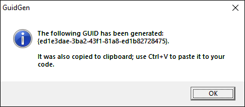

# YaGg
Yet another GUID generator

A simple tool made around 2007 that generates a new GUID and copies it into clipboard upon execution.

Its quite handy when editing some data text files and you need to insert fresh and unique GUIDs; add it as a external tool to your editor of choice.
